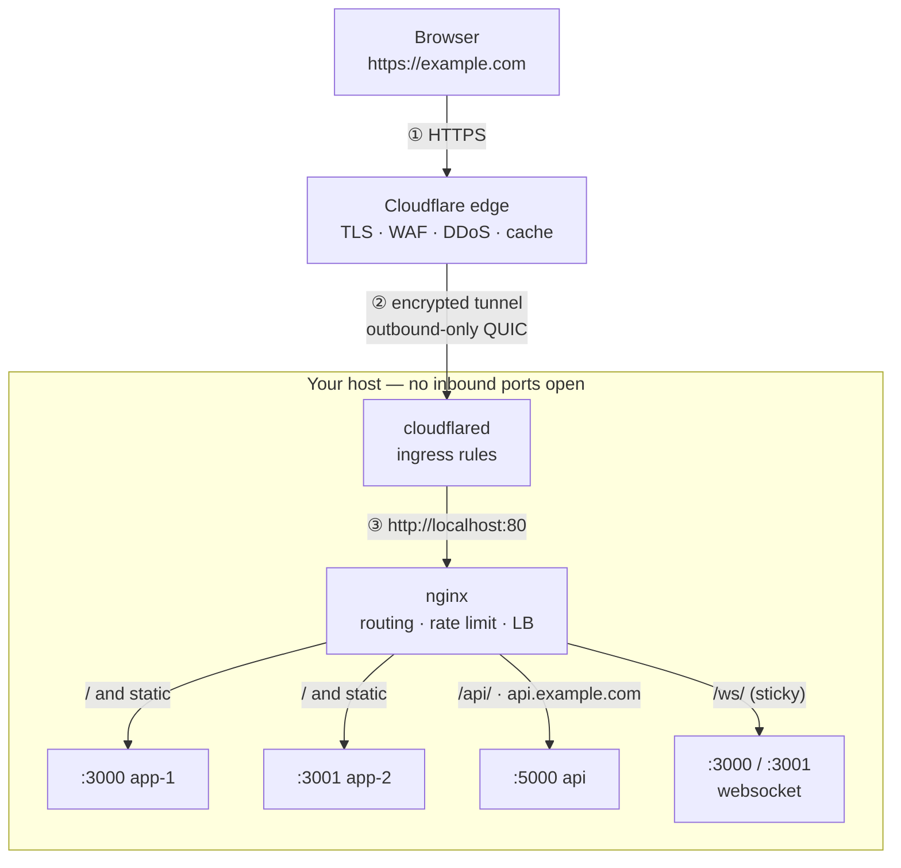

# Architecture

How a request travels from a browser to your application, and what each hop is
responsible for.

> **This repo's live deployment (`px.tinyorbit.org`) diverges from the
> generic multi-tier diagram below**: there is one backend, not four — a
> containerized remote browser — and Cloudflare Access gates the hostname
> before step ① even reaches the tunnel. See SETUP.md's
> ["Remote browser service"](SETUP.md#remote-browser-service) for the actual
> shape. The rest of this document (compression, real-IP restoration, the
> tunnel mechanics) still applies unchanged.

## Traffic flow

```
        ┌──────────────┐
        │   Browser    │  https://example.com
        └──────┬───────┘
               │  ① HTTPS (TLS to Cloudflare's certificate)
               ▼
   ┌───────────────────────────┐
   │   Cloudflare edge (PoP)   │   DNS · TLS termination · WAF · DDoS
   │   nearest to the visitor  │   caching · bot filtering
   └───────────┬───────────────┘
               │  ② encrypted tunnel over QUIC/HTTP2
               │     (outbound-only, mutually authenticated)
               ▼
 ═══════════════════════════════════════════════════════════ your host ═══
   ┌───────────────────────────┐
   │  cloudflared (daemon)     │   matches ingress rules from config.yml
   │  ~/.cloudflared/config.yml│   → picks a local service per hostname
   └───────────┬───────────────┘
               │  ③ plain HTTP to 127.0.0.1:80
               ▼
   ┌───────────────────────────┐
   │  nginx                    │   vhost + path routing · rate limiting
   │  /etc/nginx/nginx.conf    │   load balancing · caching · WebSocket
   └───────────┬───────────────┘   upgrade · real-IP restoration
               │  ④ plain HTTP to loopback ports
     ┌─────────┼──────────┬─────────────┐
     ▼         ▼          ▼             ▼
 ┌────────┐ ┌────────┐ ┌────────┐  ┌──────────┐
 │ :3000  │ │ :3001  │ │ :5000  │  │  :3000/1 │
 │ app-1  │ │ app-2  │ │  api   │  │ websocket│
 └────────┘ └────────┘ └────────┘  └──────────┘
  app_backend (least_conn)  api_backend   ws_backend (sticky)
```



## What each hop does

### ① Browser → Cloudflare edge

DNS for `example.com` is a **proxied CNAME** pointing at
`<tunnel-id>.cfargotunnel.com`. Because the record is proxied (orange cloud),
the name resolves to Cloudflare anycast IPs, so the visitor connects to the
Cloudflare data centre closest to them — never to your host, whose address is
never published.

TLS terminates here, using Cloudflare's certificate. Your origin needs no
certificate, no renewal cron, and no port 443.

### ② Cloudflare edge → cloudflared

This is the important bit. **`cloudflared` dials out to Cloudflare; Cloudflare
never dials in.** The daemon opens four long-lived, mutually authenticated
QUIC connections (spread across two data centres for redundancy) and requests
are multiplexed back down them.

Consequences:

- **No inbound firewall rule, no port forwarding, no public IP.** The host can
  sit behind NAT or a restrictive firewall with every inbound port closed.
- **The origin IP is unpublishable**, so direct-to-origin DDoS and origin
  scanning are not possible.
- If the tunnel drops, `cloudflared` reconnects on its own and Cloudflare
  serves an error page in the meantime.

`cloudflared` then consults the `ingress` list in `config.yml`, top to bottom,
and forwards the request to the first rule whose hostname matches. All three
hostnames in this setup point at `http://localhost:80` — nginx — so routing
decisions live in one file rather than two.

### ③ cloudflared → nginx

Plain HTTP over loopback. Encrypting this hop would be pointless: it never
leaves the machine. Cloudflare's original request headers are preserved,
including:

| Header              | Meaning                                            |
| ------------------- | -------------------------------------------------- |
| `CF-Connecting-IP`  | the visitor's real IP address                       |
| `CF-Ray`            | request ID, searchable in the Cloudflare dashboard  |
| `X-Forwarded-Proto` | `https` — what the *browser* used                   |
| `CF-IPCountry`      | visitor's country (when enabled)                    |

### ④ nginx → backends

nginx is where per-request policy is applied. In order:

1. **Real IP restoration.** Every request arrives from `127.0.0.1`, so without
   `set_real_ip_from` / `real_ip_header CF-Connecting-IP`, access logs would
   show only the loopback address and — worse — every visitor would share a
   single rate-limit bucket. This is why the `real_ip` block comes first.

2. **Virtual host selection** by `Host` header:
   `example.com` / `www.example.com` → the app vhost, `api.example.com` → the
   API vhost, anything else → `return 444` (connection dropped, no response).

3. **Location matching**, in nginx's fixed precedence order:

   | Order | Location                     | Goes to                     |
   | ----- | ---------------------------- | --------------------------- |
   | 1     | `= /health`                  | answered by nginx itself     |
   | 2     | `^~ /api/`                   | `api_backend` (rate limited) |
   | 2     | `^~ /ws/`                    | `ws_backend` (upgraded)      |
   | 3     | `~* \.(css\|js\|png\|…)$`    | `app_backend`, cached hard   |
   | 4     | `/`                          | `app_backend`                |

   The `^~` markers on `/api/` and `/ws/` matter: without them the static-asset
   regex would win for a path like `/api/v1/report.json` and send an API call to
   the app tier.

4. **Rate limiting** on `/api/` only — 10 r/s sustained per client IP with a
   burst of 20, then `429`.

5. **Load balancing.** `app_backend` uses `least_conn` across `:3000` and
   `:3001`; `ws_backend` uses `hash $binary_remote_addr consistent` so a socket
   keeps talking to the node holding its session. (`ip_hash` would be useless
   here — every connection appears to come from `127.0.0.1`, so all sockets
   would land on one node.)

6. **Passive health checks.** A backend that fails twice within `fail_timeout`
   is pulled out of rotation for 15 seconds, and `proxy_next_upstream` retries
   the request on a surviving node, so a single dead backend is invisible to
   users.

## Request lifecycle example

`GET https://example.com/api/v1/users` from a visitor in Berlin:

1. DNS returns Cloudflare anycast IPs; the browser connects to the Frankfurt PoP.
2. TLS terminates at the edge; WAF rules and DDoS protection run.
3. The edge finds a healthy tunnel connection and forwards the request.
4. `cloudflared` matches `hostname: example.com` and proxies to `localhost:80`.
5. nginx restores the real IP from `CF-Connecting-IP`, selects the
   `example.com` vhost, matches `^~ /api/`.
6. The rate limiter checks this visitor's bucket. Over budget → `429`, done.
7. Under budget → proxied to `127.0.0.1:5000` with `X-Real-IP`,
   `X-Forwarded-For`, `X-Forwarded-Proto: https` and a generated `X-Request-ID`.
8. The response travels back up the same path. nginx logs it with the upstream
   address, timing and `CF-Ray`.

## Why this shape

| Concern                  | Handled by                | Why there                                               |
| ------------------------ | ------------------------- | ------------------------------------------------------- |
| TLS certificates         | Cloudflare edge           | free, auto-renewing, nothing to maintain on the host     |
| DDoS / WAF / bot filter  | Cloudflare edge           | absorbed before it ever reaches your bandwidth           |
| Exposure of the origin   | Tunnel (outbound-only)    | no inbound ports means no attack surface to scan         |
| Host/path routing        | nginx                     | one file to change when a backend moves                  |
| Rate limiting            | nginx                     | needs the real client IP, restored one hop earlier       |
| Load balancing, failover | nginx                     | closest to the backends, fastest to react                |
| Static caching           | nginx + Cloudflare        | nginx sets the headers; the edge honours them globally   |

## Failure modes

| What breaks            | Symptom                          | Who reports it            |
| ---------------------- | -------------------------------- | ------------------------- |
| A backend dies         | nothing visible; traffic shifts  | nginx `error.log`         |
| All app backends die   | `502` / custom `50x` page        | nginx `error.log`         |
| nginx is stopped       | `502` from Cloudflare            | `journalctl -u cloudflared` |
| `cloudflared` stopped  | Cloudflare error 1033            | Cloudflare dashboard      |
| DNS record not proxied | `1016 Origin DNS error`          | Cloudflare dashboard      |

## Scaling this

- **More app instances** — add `server 127.0.0.1:3002;` to the `app_backend`
  upstream and reload. `least_conn` picks it up immediately.
- **More API workers** — same, in `api_backend`.
- **Multiple hosts** — run `cloudflared` on each with the *same tunnel name*.
  Cloudflare load balances across every connected replica automatically.
- **Backends on other machines** — replace `127.0.0.1:3000` with the private
  address, and consider TLS for that hop since it now leaves the host.

See [SETUP.md](SETUP.md) for installation, DNS configuration and troubleshooting.
