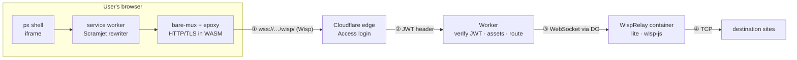

# Architecture

How a page reaches a user of `px.tinyorbit.org`, what each hop does, and why
the container needs almost no CPU.

- Setup, cost table, tuning and operations: [README.md](README.md)

## The one-line version

The old design streamed *pixels* of a browser running in a container. The new
design streams *bytes* to a browser running on the user's machine. Rendering
is the expensive part, and it now happens where it is free.

## Traffic flow

```
 ┌────────────────────────────────────────── user's browser ──────────────────────────────────────────┐
 │  px shell (public/index.html, app.js)                                                             │
 │     └─ <iframe> /scramjet/<encoded url>   ← proxied page renders here, like any web page          │
 │                                                                                                    │
 │  service worker (public/sw.js + Scramjet)  ← intercepts every fetch the page makes,               │
 │     │                                         rewrites URLs / HTML / JS / CSS so they stay          │
 │     ▼                                         inside this origin                                    │
 │  SharedWorker (bare-mux) → epoxy transport ← HTTP + TLS client compiled to WASM: talks TLS          │
 │     │                                         to the destination site, end to end                   │
 └─────┼──────────────────────────────────────────────────────────────────────────────────────────────┘
       │ ① one WebSocket: wss://px.tinyorbit.org/wisp/   (Wisp: many TCP streams multiplexed)
       ▼
 ┌────────────────────────────────┐
 │ Cloudflare edge                │  TLS · WAF · Cloudflare Access login (email OTP, Proxy-Users policy)
 └───────────────┬────────────────┘
                 │ ② request + Cf-Access-Jwt-Assertion header
                 ▼
 ┌────────────────────────────────┐
 │ Worker  (src/index.ts)         │  verifies the Access JWT (issuer, audience, signature, expiry)
 │                                │  serves public/ from Static Assets
 │                                │  /wisp/  → getContainer(RELAY, sha256(email))
 └───────────────┬────────────────┘
                 │ ③ WebSocket, relayed frame by frame through the Durable Object
                 ▼
 ┌────────────────────────────────┐
 │ WispRelay  (src/relay.ts)      │  Durable Object: starts / stops the container, idle timer
 │   └─ container  (container/)   │  Node 22 + wisp-js: one WebSocket in, N TCP sockets out
 └───────────────┬────────────────┘  `lite` instance: 1/16 vCPU, 256 MiB
                 │ ④ plain TCP, opaque TLS bytes
                 ▼
          destination websites
```



## What each hop does

### ① Browser: rendering, rewriting, TLS

Everything CPU-heavy lives here:

- **Scramjet** runs in a service worker. It intercepts each request the
  proxied page makes, fetches it through the transport, and rewrites the
  response (URLs in HTML/CSS, `location`/`document.domain`/`fetch` and friends
  in JavaScript) so the page keeps working under `/scramjet/…` on our origin.
  Cookies and storage for proxied sites are emulated per site inside the
  browser's own IndexedDB.
- **epoxy** is an HTTP client with its own TLS stack (Rust → WASM). It opens
  the TLS session to the destination *inside the browser*, so the relay only
  ever sees ciphertext. Certificate validation happens here too.
- **bare-mux** keeps the transport in a SharedWorker so every tab, iframe and
  the service worker share one Wisp connection.

The result is that the container is not "a browser"; it is a NAT box.

### ② Cloudflare edge

`px.tinyorbit.org` is a Worker custom domain. Cloudflare terminates TLS and
the Access application on the hostname forces a login before anything reaches
the Worker. Access then adds a signed JWT (`Cf-Access-Jwt-Assertion`) to every
request, including the WebSocket upgrade.

### ③ Worker → Durable Object → container

The Worker (`src/index.ts`) checks the JWT on **every** request, so even if
the hostname's Access policy were removed by mistake the container could not
be reached (`workers_dev` and preview URLs are disabled for the same reason).
Static files come from Workers Static Assets, served at the edge and never
touching the container.

`/wisp/` is the only path that reaches a container. `getContainer(env.RELAY,
name)` picks a Durable Object per user (`sha256(email)`; or one shared object
with `RELAY_MODE=shared`), and `@cloudflare/containers` does the rest:

- starts the container on first use and waits for port 8080;
- relays the WebSocket through the object, renewing the idle timer on each
  frame, so a session in use never sleeps;
- stops the container `sleepAfter` (`RELAY_SLEEP_AFTER`, 5 min) after the last
  frame, at which point billing stops. The next connect cold-starts it in a
  few seconds; the browser-side transport reconnects by itself.

### ④ The relay

`container/server.mjs` is ~80 lines around `@mercuryworkshop/wisp-js`. For
each Wisp `CONNECT` packet it opens a TCP socket to `host:port` and shuttles
bytes both ways, with per-stream flow control (128-packet windows, sockets
paused when the browser is slower than the site). Guard rails:

| Rule                                   | Why                                                          |
| -------------------------------------- | ------------------------------------------------------------ |
| TCP only, no UDP                       | Browsing does not need it; avoids a generic UDP forwarder    |
| Private and loopback IPs refused       | A page cannot probe the container's network                  |
| Port 25 refused                        | No spam relaying                                             |
| 256 streams per WebSocket              | A runaway page cannot exhaust the relay                      |
| Logs at WARN, no client IP parsing     | Nothing identifying is written inside the container          |
| `uncaughtException` handler            | One bad stream cannot kill everyone's session                |

## Why the CPU is tiny

| Design                      | Work done in the container per page                                    | Steady-state CPU                     |
| --------------------------- | ---------------------------------------------------------------------- | ------------------------------------ |
| Firefox + Xvfb + KasmVNC    | fetch, TLS, parse, layout, JS, paint, composite, capture, video-encode, audio | 1–2 cores while a tab is doing anything; never idle (screen polling) |
| Wisp relay (this design)    | copy ciphertext between a WebSocket and TCP sockets                    | measured below                       |

Measured by `scripts/e2e.mjs` (Node 22, headless Chromium, everything on
loopback so the numbers are relay cost only):

| Scenario                              | Relay CPU                 | Notes                                          |
| ------------------------------------- | ------------------------- | ---------------------------------------------- |
| Idle with a session open, 5 s         | 10 ms (0.2% of a core)    | Wisp keepalives only                           |
| Page with 150 image requests          | 40–50 ms → ~0.3 ms/request | HTTP keep-alive means few TCP streams          |
| 32 MB download                        | 230–310 ms → 7–10 ms/MB   | 35 MB/s on loopback, 25–35% of one core        |
| Resident memory                       | 75 MB idle, 120 MB peak   | V8 heap capped at 128 MB; buffers are bounded  |

A `lite` instance gets 1/16 of a vCPU: 62.5 CPU-ms per wall second. At 7–10
ms/MB that sustains ≈ 6–9 MB/s (≈ 50–70 Mbit/s) before throttling, and a page
load of a few hundred requests costs well under 100 ms of CPU. Throttling degrades
gracefully (slower transfers), it does not fail.

If a shared relay serves many people at once, or usage is video-heavy, `basic`
(1/4 vCPU, 1 GiB) is the next step and is still a fraction of `standard-3`.

## Lifecycle of a session

1. User opens `https://px.tinyorbit.org`; Access logs them in; the Worker
   serves `index.html`.
2. `proxy-setup.js` initialises Scramjet (config is stored in IndexedDB for
   the service worker), registers `/sw.js`, and tells bare-mux to load the
   epoxy transport with `wss://px.tinyorbit.org/wisp/`.
3. The user types an address. `app.js` creates a Scramjet frame and navigates
   it to `/scramjet/<encoded url>`.
4. The service worker intercepts that navigation, asks the transport for the
   page; epoxy opens the WebSocket (cookie → Access → Worker → Durable Object
   → container starts if needed) and a Wisp stream to the site, does TLS,
   sends the HTTP request.
5. Response bytes flow back over the same WebSocket; Scramjet rewrites the
   HTML; the iframe renders it; every subresource repeats step 4 over the
   existing WebSocket (new Wisp streams, or reused keep-alive connections).
6. When the tab closes, the WebSocket closes; five minutes later the Durable
   Object stops the container.

A proxied URL that reaches the Worker directly (new browser profile, evicted
service worker) gets `bootstrap.html`, which installs the worker and reloads.

## Security model

| Concern                                    | Handled by                                                    |
| ------------------------------------------ | ------------------------------------------------------------- |
| Who may use it                             | Cloudflare Access (edge) **and** JWT verification in the Worker |
| Can the container be reached without login | No: every non-`/health` route requires a valid JWT; no workers.dev route |
| Can a page read other users' traffic       | No: per-user relays; TLS ends in the user's own browser        |
| Can a page attack the relay's network      | No: private/loopback destinations refused, UDP off, port 25 off |
| Can the relay see page content             | No: it carries TLS ciphertext                                  |
| Can the relay see who the user is          | No: the Worker strips cookies/JWT before forwarding; the relay logs no client IPs |
| Where does page JavaScript run             | In the user's browser sandbox, under the proxy origin (see README limitations) |
| Does anything touch the Mac                | No: the host stack is gone                                     |

## Failure modes

| What breaks                     | Symptom                                    | Where to look                                   |
| ------------------------------- | ------------------------------------------ | ----------------------------------------------- |
| Access misconfigured            | `503 px is not configured yet`             | `wrangler.jsonc` vars                            |
| Token rejected                  | `403 Forbidden: invalid …`                 | `wrangler tail` (reason is logged)               |
| Container cannot start          | `503 There is no Container instance …`     | `max_instances`, Containers dashboard            |
| Relay crashes                   | Wisp socket drops; transport reconnects; cold start | `wrangler tail` (`relay … stopped`)      |
| Site blocks datacenter IPs      | Captcha or 403 inside the frame            | Nothing to fix here; different site or search engine |
| Site breaks under rewriting     | Blank frame / JS errors                    | Scramjet issue tracker; try another site         |

## Alternatives considered

- **Keep a real browser, smaller instance.** A desktop browser needs ~1 GiB
  and a real core just to idle; `basic` is too small and `standard-1` still
  encodes video for every frame. Costs stay in the same order as before.
- **No container at all (Worker-only relay with `connect()`).** Workers cannot
  open raw TCP to Cloudflare IP ranges, which rules out a large fraction of
  the web. A Worker-only *HTTP* proxy (`fetch()`-based bare server) is
  possible but weaker: no WebSockets to arbitrary hosts, and the site sees
  Worker egress. The container relay keeps full TCP semantics.
- **Rust relay (`epoxy-server`).** Lower CPU and memory than Node, but it
  needs a Rust toolchain in the image build. The Node relay already fits
  `lite` with margin; swap later if usage grows.
- **Ultraviolet instead of Scramjet.** Ultraviolet is unmaintained; its
  authors point to Scramjet. Scramjet 1.x (stable) is used with the matching
  bare-mux 2 and epoxy-transport 2 generation (epoxy-transport 3 targets the
  newer proxy-transports interface and is not compatible).
